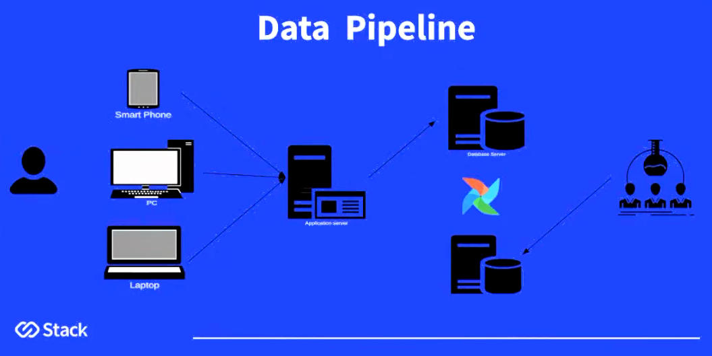
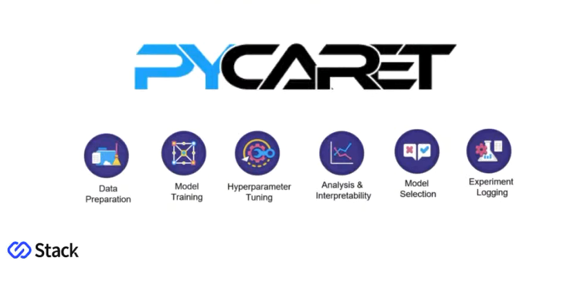

# Stack - Rental Predicting

Tecnologias:

     
## 📃 Descrição do projeto
O objetivo do projeto é desenvolver uma aplicação de Machine Learning para predizer o preço do aluguel de um imóvel, de acordo com seus atributos.

O projeto envolve **Regressão Linear** e foi desenvolvido durante um bootcamp de Ciência de Dados da [Stack Tecnologias](https://stacktecnologias.com.br/).

### Entendimento do negócio

A empresa deseja saber:

* **Qual o preço ideal de aluguel para um imóvel?**
* **Como reduzir prejuízos ao definir o valor do aluguel?**
* **Quais variáveis influenciam no preço do imóvel?**

### Etapas do projeto
- Data Mining com MYSQL Server via Docker
- Automatização do Pipeline de dados com Apache Airflow e MSQL
- Análise exploratória com Python e Jupyter Notebook
- Machine Learning com AutoML - Pycaret
- Data WebApp com Streamlit

### Dados da fonte

* **Banco de dados de produção**:
  * Tabela imoveis - 10.000 imóveis cadastrados.
  * Tabela cidade - 4 cidades.
  * Tabela estado - 4 cidades.
  * Tabela proprietario - 10.000 cadastros.

## Data Pipeline

Foi criado um Pipeline de Dados com o orquestrador Airflow e o MYSQL Server, para que a extração dos dados possa ser feita diariamente de forma automática.

Os dados extraídos do banco de dados de produção são armazenados no **Data Warehouse**. O objetivo é criar uma fonte segura para manipulação e análise de dados, sem interferir diretamente no banco de dados do sistema. 

Toda a transformação dos dados **(Data Cleaning/Transformation)** é realizada durante a extração, através de um ETL.

O Pipeline foi desenvolvido utilizando o orquestrador Airflow e a tecnologia de container(Docker).

Visão geral do Pipeline:

Fonte Youtube: <a href="https://www.youtube.com/c/Stack_tecnologias">Stack</a>

## Resumo geral do projeto

### Análise Exploratória

Após a coleta dos dados foi feita a **Análise Exploratória dos Dados**, para resolver as principais dúvidas da empresa. Foram utilizadas técnicas de análise descritiva, análise univariáda e análise bivariada, para analisar variáveis categóricas e numéricas.

* **Insights principais:**
  * Existe forte correlação entre o **valor do seguro** e o **preço do aluguel**.
  * Existe uma correlação entre o número de garagem e o valor do imóvel.**
  * O número de quartos influencia diretamente o valor do aluguel.**
  * O preço dos imóveis que aceitam animais são um pouco mais caros.**
  * A maioria dos imóveis não mobiliados possuem o maior valor de aluguel.**
  * Existe uma correlação positiva entre o número de garagem e o valor do imóvel.**

### Machine Learning

Para criar o modelo supervisionado, foi realizado o processo de Machine Learning utilizando AutoML (Pycaret).

O pacote Pycaret oferece várias funções de Machine Learning, além de aumentar a produtividade do processo.

O melhor modelo escolhido foi o **Extra Trees Regressor**.

Visão geral do Pycaret:

Fonte Youtube: <a href="https://www.youtube.com/c/Stack_tecnologias">Stack</a>

### Deploy do Data App - Streamlit

Após a criação do modelo preditivo foi criado um Data App utilizando o Stremlit Share.